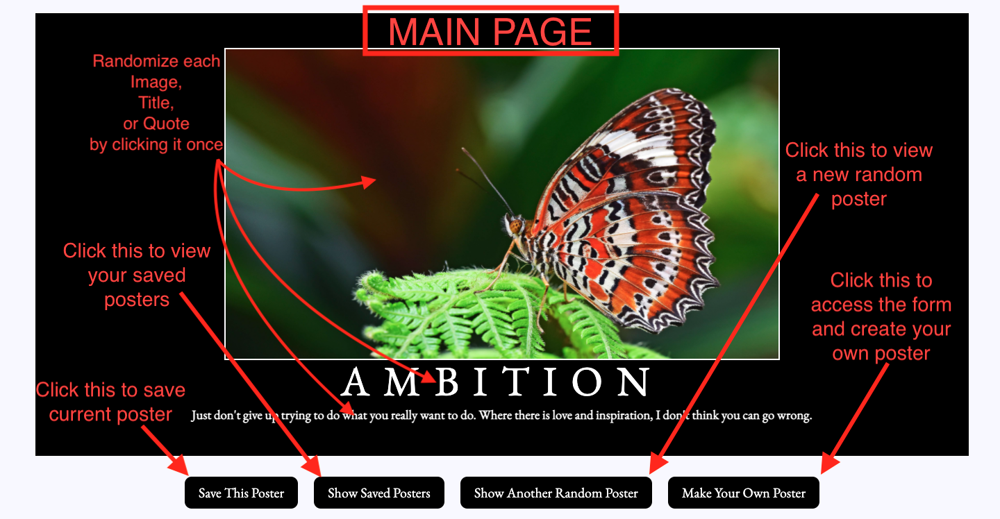
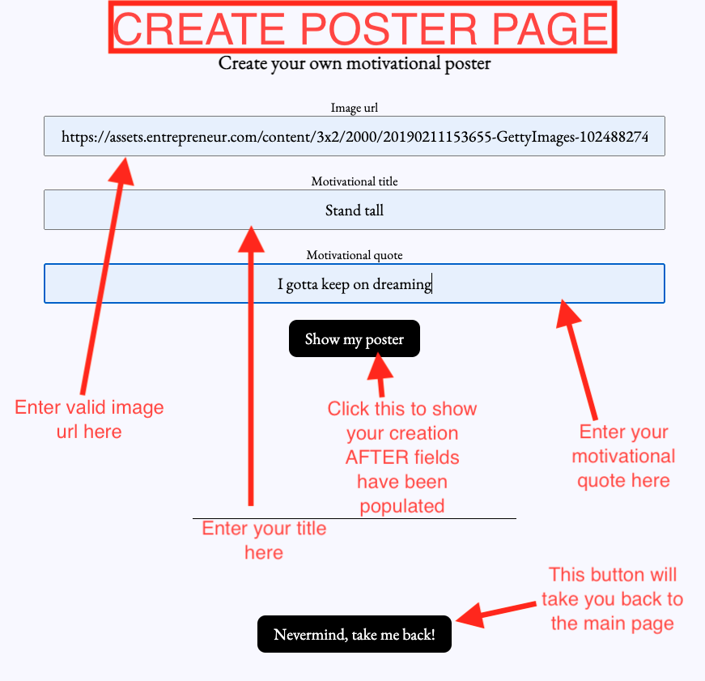
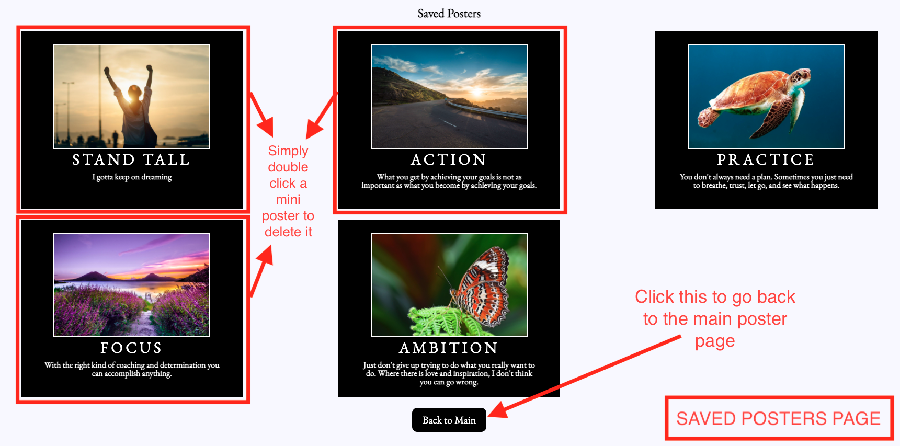

# Hang In There

#### Project Contributors: Tyson McNutt + Zach Johnson

#### Technologies Used
  - Utilizing vanilla JavaScript to manipulate HTML/CSS through DOM

#### Instructions

1. Follow [this link](https://zachjjohns.github.io/hang-in-there-boilerplate/) to view the site
2. Data is stored temporarily and will be removed upon page refresh
2. Click "Show Another Random Poster" to generate a random poster from pre-established values
3. Click "Make Your Own Poster" and input image URL + Title/Quote for your own poster!
4. Click "Save This Poster" to save and view later by clicking "Show Saved Posters"
5. Double-click saved posters to delete from page
6. Navigate around, make some silly/inspiring posters, and have fun!

